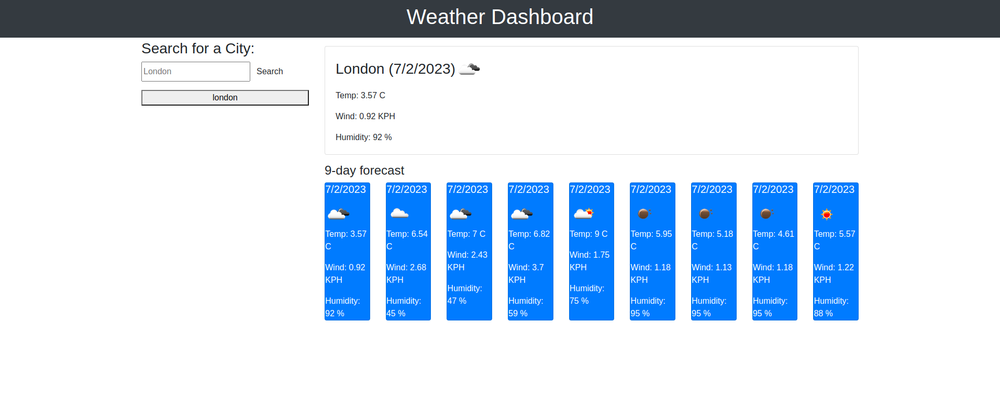

# WeatherDashboard
Server APIs 

This code is a JavaScript/jQuery code for implementing a weather app. It defines variables for API url, API key, and containers for search history, search input and form, and current weather. It also includes functions for rendering search history, appending new search history, rendering current weather, fetching weather data, fetching coordinate data, and initializing search history.

The renderSearchHistory function creates <button style='font-size:12px'>Buttons <i class='fas fa-baby-carriage'></i></button>  for each element of the searchHistory array and appends them to the searchHistoryContainer element. The appendSearchHistory function adds a new search to the searchHistory array and saves it to local storage. The renderCurrentWeather function creates a card element with current weather data and appends it to the todayContainer element.

The fetchWeather function takes in a location object and makes an API call to get weather data using the latitude, longitude, and API key. The fetchCoord function takes in a search input and makes an API call to get coordinate data. The initializeHistory function retrieves the stored search history from local storage and calls renderSearchHistory to render it on the page.

